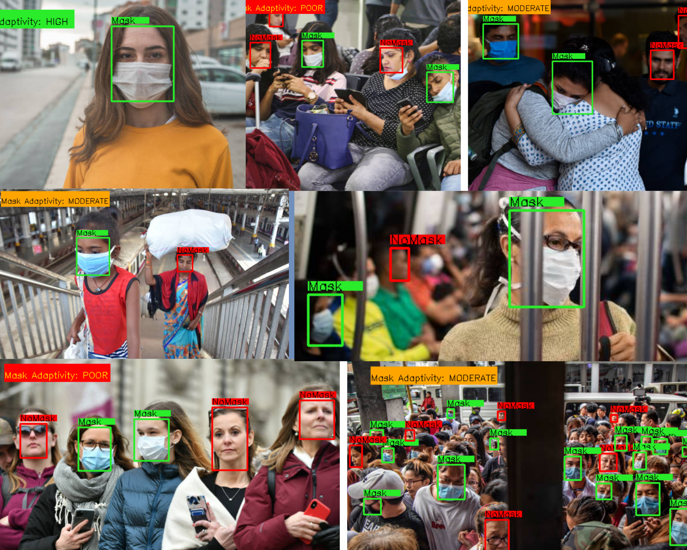
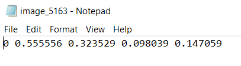

# FaceMask-Adaptivity-Detection
Face mask rapidly became the symbol of COVID-19 pandemic and a new normal. Countries emerging from lockdown are making it mandatory to wear a mask in public and to avail general services. Enforcing this new norm also brings new challenges to the agencies across the globe, i.e our security cameras are not equipped to track automatically if the social distancing and other precautionary measures are being followed or not. In this case study, our intention is to develop a solution to keep track the mask adaptivity of crowd, to track if most people are using a mask or not.

#### Objective
**The Problem Statement**
- Based on the number of people wearing masks, determine if the mask adaptivity is poor, moderate or high. Technically we can break down as follow:
- Detect Number of people wearing mask in a frame(X).
- Detect Number of people not wearing mask in a frame(Y).
- Calculate the metric (X/(X+Y)), based on certain thresholds determine the category of adaptivity.

## 
- Model: Tiny YOLO (a state of the art object detection framework based on Convolution Neural Networks) mode
- Framework: Darknet
- Data Annotator: LabelImg Tool (attached the downloadable in the repo) 
		- download from https://tzutalin.github.io/labelImg/
	
## How LabelImg Works

It will create a txt file like below containing the label and coordinates of the bounding box.

## How to Reproduce
Please refer to the Notebook in the repo.

## Trained Models
https://drive.google.com/drive/folders/1n4zBiPr02W1bhaYqtYj6hHleXEVFw-km?usp=sharing

## Data
https://drive.google.com/drive/folders/1T6N4qd4ep2YgxXdpCrkngOe_o1NszHH_?usp=sharing

## Additional Reference Links & Citations
https://pjreddie.com/darknet/yolo/
https://tzutalin.github.io/labelImg/
https://drive.google.com/drive/folders/1T6N4qd4ep2YgxXdpCrkngOe_o1NszHH
https://github.com/AlexeyAB/darknet
https://arxiv.org/abs/1506.02640

## License
Copyright 2020 DeepHiveMind
